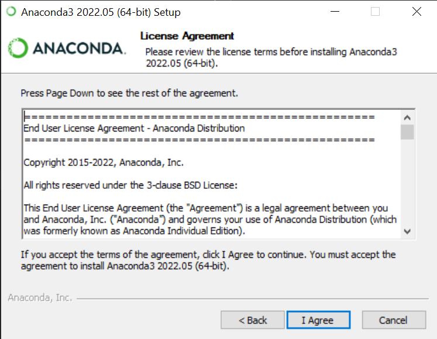
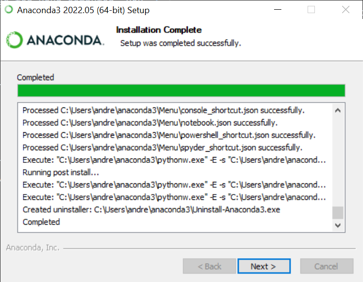
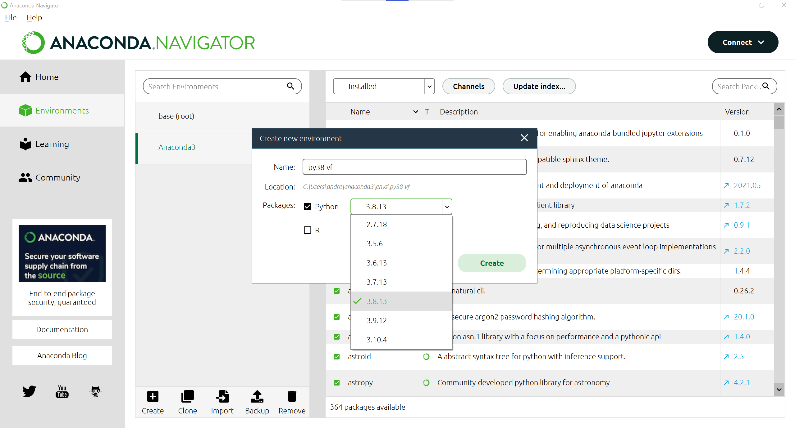

# API for Accessing Virtual Fence Data

This repo contains Python scripts and configuration files for accessing virtual fence data from the Vence Corporation. This API is written and maintained by a third-party and no warranty or responsibility is implied for or by the Vence Corporation. You are free to modify the code as you see fit (see LICENSE).

## Who Can Access Data?
- Need to be an existing Vence customer
- Need a database username and password from Vence
  - Please contact your Vence representative to obtain a database username and password
  - *Note: this username and password is different from the username and password you use to access HerdManager*
- Limited to accessing data from your customer account only

This API allows one-way access of data meaning you can pull data but you cannot modify the data inside of the Vence database. 

## What It Does
The Python script [`api.py`](https://github.com/amantaya/Vence-API/blob/main/api.py) will request message data from virtual fence collars from your customer account based on a start and end date. The start date and end date is configured in the [`config.json`](https://github.com/amantaya/Vence-API/blob/main/config/config.json) file.  

## How to Set It Up
This tutorial assumes you are starting fresh with a new installation of Python, and doesn't require any experience with coding in Python.  

## Requirements
- Python >3.8 
- `Requests` library 
- `Pandas` library

## Setting Up a Python Environment
Anaconda (https://www.anaconda.com/) is a free platform for downloading and managing Python environments. Anaconda includes a navigator for selecting different Python environments as well as command line tools for setting up `conda` environments. We will use Anaconda to configure a Python 3.8 environment to run [`api.py`](https://github.com/amantaya/Vence-API/blob/main/api.py).

Supplemental info:
[What is a Python Environment?](https://docs.conda.io/projects/conda/en/latest/glossary.html#conda-environment)

### Downloading Anaconda
Download (https://www.anaconda.com/) the Anaconda distribution appropriate for your operating system. Anaconda is available for Windows, MacOS, and Linux. 


### Installing Anaconda on Windows
Open the Anaconda installer from your "Downloads" folder.

Supplemental info:
[Installing Anaconda](https://docs.anaconda.com/anaconda/install/)


Click "Next" to proceed with installation.


Click "I Agree" to agree to the Licensing agreement.



Then select the installation type. If you have adminstrator privelages for your computer, you can select "All Users", otherwise select "Just Me".


Select where you want to install Anaconda on your computer. The default location is usually fine. 


**Advanced Options:** You can set Anaconda as your default Python version for your computer. It is checked by default. You can also add Anaconda to your PATH environment variable, but this is not recommended. Once you have selected your options, click "Install" to install Anaconda on your computer. 


Anaconda will begin installing all of required dependencies: packages and scripts required to run Anaconda.


Once Anaconda has completed installing, click "Next".



You can safely skip the next screen about DataSpell.


On the next screen, you can leave the tutorial checkboxes checked, or uncheck them if you do not want to follow the tutorials. Then click "Finish".


Next, open the Anaconda Navigator from your Windows Start Menu.


You will see a series of black command prompt windows open and then quickly close. This is normal. Anaconda is running scripts to launch and configure Anaconda.

You also might be prompted to update Anaconda Navigator from a clean install. Updating Anaconda Navigator shouldn't effect your Python (conda) environments. 


You don't have to open Anaconda every time you want to run a Python script. Anaconda comes with a Python console called "Anaconda Prompt" that you can use to run Python scripts without launching Anaconda Navigator or an Integrated Development Environment (IDE) like PyCharm, Spyder, or R Studio.

### Creating A *conda* Environment
[`api.py`](https://github.com/amantaya/Vence-API/blob/main/api.py) requires Python 3.8 and several libraries (packages) to be installed to function properly. We will be using Anaconda to create a Python environment with the correct version of Python and the required dependencies.

Click on the  button on the left side of Anaconda Navigator to go the "Environments" page.


Click the "Create"  button to create a new *conda* environment. 


A window called "Create new environment" will open. Set the name of the new Python environment to `py38-vf` . This is an abbreviation for Python version 3.8 and virtual fence. We will configure this *conda* environment with correct version of Python (3.8). `py38-vf` is the name of the *conda* environment. 


Under the "Packages" drop-down menu, select Python **3.8.13**



Then click "Create". 

Once Anaconda has finished creating the new environment, you should see a new option called `py38-vf`. Anaconda installed a few commonly used packages inside of this environment.


### Installing Required Packages


We will install the required packages using Anaconda Navigator. First, change the "Installed" dropdown menu to "All".


Then search for "requests" in the "Search Packages" search box and click the checkbox next to the "requests" package. *Note: leave the checkbox checked next to the "requests" package.*


Next, search for "pandas" in the search box and click the checkbox next to the "pandas" package. You should now see "2 packages selected" along the bottom. Then click "Apply".


A new window called "Install Packages" will open indicating that 27 packages will be installed. 

*Note:* You may be wondering why there are more than 27 packages being installed when we selected only 2 packages. Each package relies on (sometimes many) other packages to function properly, collectively these are called **dependencies**.

Click "Apply" to install all of the required packages.


Once the packages have finished installing, you can launch a Python console or terminal using the  button. 


We will use the "Open Terminal" option.


A command prompt window will open with the correct Python environment `py38-vf` already activated. 


*Note:* Because we launched this Python environment from Anaconda Navigator, we are already inside of the correct Python environment `py38-vf`. If you launch Anaconda Prompt, you will have to use:

```shell
conda activate py38-vf
```

## Downloading the `api.py` Python script

Next, we need to download the [`api.py`](https://github.com/amantaya/Vence-API/blob/main/api.py) script and place it inside our current working directory.

Go to https://github.com/amantaya/Vence-API and click the  button and then select "Download Zip".

## TODO circle the Download zip in photoshop


*Note:* If you are familiar with Git, you could also use:
```
git clone https://github.com/amantaya/Vence-API.git
```

Next, move the **Vence-API-main.zip** file from your "Downloads" folder to a better location on your computer, such as your "Users" folder, e.g.,

**C:\Users\andre**

The important thing is to note *where* the file is on your computer.

Next, uncompress (unzip) the downloaded code by double-clicking on the .zip file and using the built-in Windows utility, or with a free utility like 7zip (https://www.7-zip.org/).

Once the folder is uncompressed, you should see a folder called "Vence-API-Main". 


Inside of this folder is the `api.py` Python script, as well as configuration files that we will need to edit.


## Configuring Username and Password

Inside of the `config` folder you there is a file called `config.json` . Open this file inside of text editor such as Notepad or the excellent and free Notepad++ (https://notepad-plus-plus.org/). Do not use Microsoft Word, as Word will insert special characters causing the file to be incorrectly formatted.


Under "customer", type in the customer value supplied to you by your Vence representative.

Under "dbuser", type in the database user supplied to you by your Vence representative.

Under "dbpassword", type in the password supplied to you by your Vence representative. 

**Note: This username and password is different from the username and password you use to access HerdManager**.


Before we save and close `config.json` we will also edit the start and end dates. 

## Configuring the Start and End Dates

The start and end dates in the `config.json` are the start and end date that you want to get data for. Editing these dates and times will pull a different date range for the data. 

Inside of a text editor, edit the "start_time" to the date and time where you would like the data to start. The date-time is in the format Year-Month-Day Hour:Minute:Seconds in the 24-hour format. Be sure to preserve this formatting exactly (keep all of the dashes, spaces, and colons) or the script will likely fail.  

Also edit the "end_time" to date and time you want the data to end.

**Note:** Pulling a large date range from the API *should* work, but may take several minutes to process based on the speed of your internet connection, processor, and the number of virtual fence collars you have in your database.

This `config.json` is configured to pull data from 2022-06-01 00:00:00.000 (June 1, 2022 at 12 midnight) to 2022-06-01 12:00:00.000 (June 1, 2022 at 12 noon).


Once you have made your desired edits to `config.json`, save the file and close the text editor.

## Running the Python script

We first need to change our current working directory to inside the `Vence-API-main` folder. 

Inside the command prompt, type:

```shell
cd ./Vence-API-main
```

You should see:


To run the API, type:
```shell
python api.py
```

The script `api.py` will loop through the date range supplied in the `config.json` file in 12 hour intervals (to prevent server timeout errors). Each iteration of the loop will print the start and end dates for that interation, as well as printing an HTTP status code which may be helpful for diagnosing server errors. 

Additionally, if any messages are missing a date or time value, `api.py` will print out an index indicating which messages are missing a date or time value. Data missing seconds or microseconds will be fixed by replacing the missing values with zeros. The script will fail and print an error message if any dates or times are missing values for the year, month, day, hour or minutes.  


Data is written to a CSV file in your current working directory (e.g. **C:/Users/andre/Vence-API-main**) inside of a new folder called "data". The file is named with the start and end date of the data, which was specified in the `config.json`.


2022-06-01_2022-06-01_Vence-message-data.csv

## Data Definitions

Nathan Jero has kindly supplied a Google Doc which defines the meaning of each column in the CSV file.

[Vence_V2_collar_data.docx](https://docs.google.com/document/d/1mSkW57wWF59D9fOm_tbnTVByqaYR4UnV/edit)